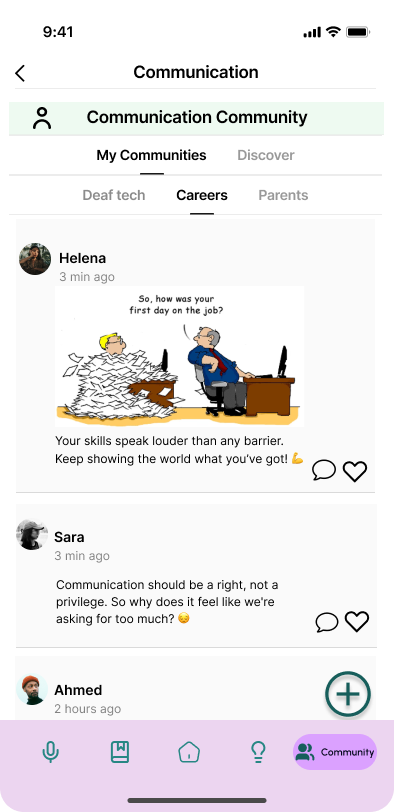
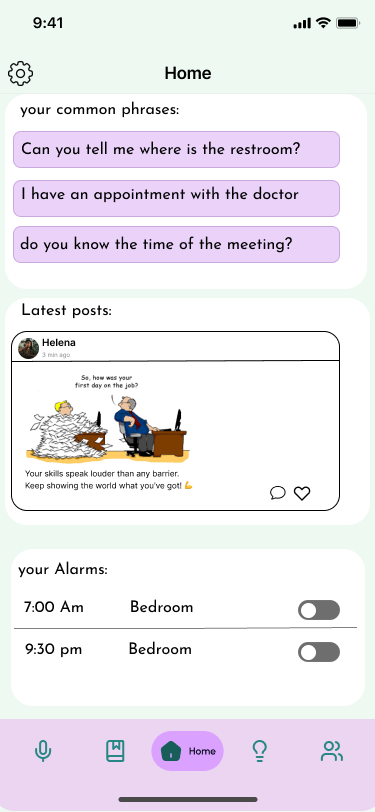
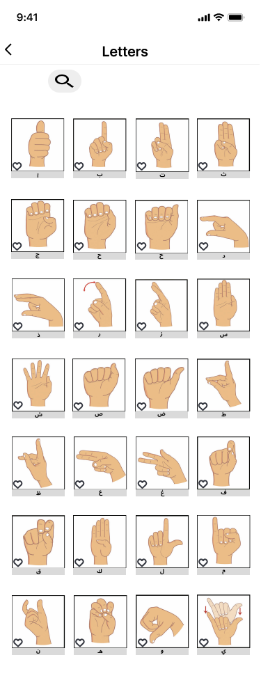

# Labeeb — UX Project (IT214)
A UX project designed in **Figma** to support and empower the **Deaf community** through inclusive features and a simple, accessible interface.

##  Goal
Design a friendly platform for Deaf users to **connect, interact, and share**.

##  Key Features
- **Community space:** join, browse posts, like & reply  
- **Discovery & profiles:** explore users, view profiles, and publish new posts

##  Tools & Process
- **Figma** (UI/UX design, prototyping)
- User-centered design principles
- Accessibility-first mindset

##  Screenshots
| Community | Home | Dictionary |
|---|---|---|
|  |  |  |

> Full screens (PDF): [Labeeb-screens.pdf](design/Untitled.pdf)

##  Demo
<!-- سيظهر مشغل فيديو مباشر لو كان mp4 مرفوع وحجمه مناسب -->
<video src="video/Demo.mp4" controls width="640"></video>

##  Team
- Jana Almengash  
- Layan Alfawaz  
- Wasan Alamri  
- Dhay Abdullah

##  License
MIT
